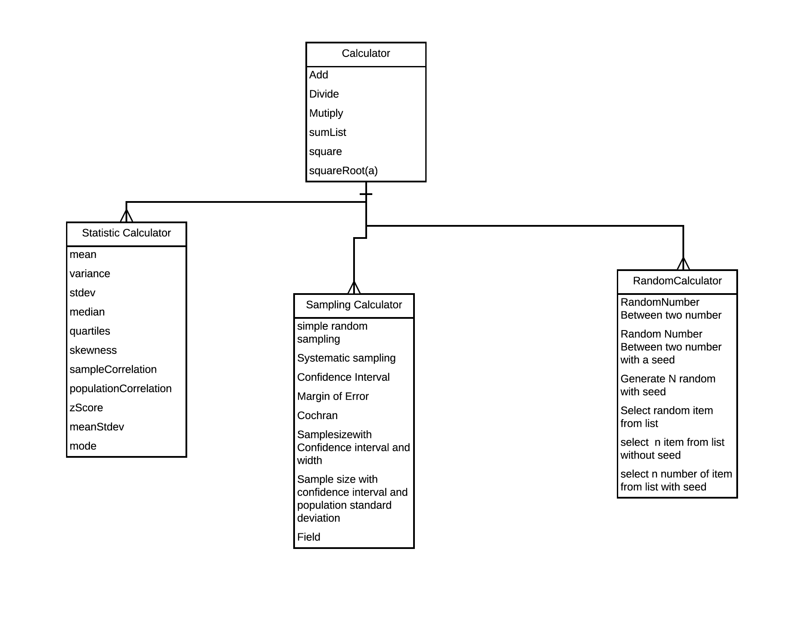

 

<h1>Group Project Assignment </h1>

<h1>Docs: <a href="https://tommywenjiezhang.github.io/is219_group_project"/>To view Github page</a> </h1>

## Classes
<dl>
<dt><a href="#RandomCalculator">RandomCalculator</a> ⇐ <code><a href="#Calculator">Calculator</a></code></dt>
<dd></dd>
<dt><a href="#StatisticsOperation">StatisticsOperation</a> ⇐ <code><a href="#Calculator">Calculator</a></code></dt>
<dd></dd>
<dt><a href="#Calculator">Calculator</a></dt>
<dd></dd>
<dt><a href="#SamplingCalculator">SamplingCalculator</a> ⇐ <code><a href="#Calculator">Calculator</a></code></dt>
<dd></dd>
</dl>

## RandomCalculator ⇐ [<code>Calculator</code>](#Calculator)
**Kind**: global class  
**Extends**: [<code>Calculator</code>](#Calculator)  

* [RandomCalculator](#RandomCalculator) ⇐ [<code>Calculator</code>](#Calculator)
    * [.seedRandom()](#RandomCalculator+seedRandom) ⇒ <code>SeedRandom</code>
    * [.selectRandom(list, [size])](#RandomCalculator+selectRandom) ⇒ <code>array</code> \| <code>number</code>
    * [.generateRand(min, max, [size])](#RandomCalculator+generateRand) ⇒ <code>array</code> \| <code>number</code>
    * [.Add(a, b)](#Calculator+Add) ⇒ <code>number</code>
    * [.Divide(a, b)](#Calculator+Divide) ⇒ <code>number</code>
    * [.Multiply(a, b)](#Calculator+Multiply) ⇒ <code>number</code>
    * [.sumList(myarray)](#Calculator+sumList) ⇒ <code>number</code>
    * [.square(number)](#Calculator+square) ⇒ <code>number</code>
    * [.squareRoot(a)](#Calculator+squareRoot) ⇒ <code>number</code>

### randomCalculator.seedRandom() ⇒ <code>SeedRandom</code>
**Kind**: instance method of [<code>RandomCalculator</code>](#RandomCalculator)  
**Returns**: <code>SeedRandom</code> - seed - new Seed  

### randomCalculator.selectRandom(list, [size]) ⇒ <code>array</code> \| <code>number</code>
Select N number of items or Select a random item from a list

**Kind**: instance method of [<code>RandomCalculator</code>](#RandomCalculator)  
**Returns**: <code>array</code> \| <code>number</code> - - list of random numbers from list or a random number from list  

| Param | Type | Description |
| --- | --- | --- |
| list | <code>arr</code> | list of numbers to be choosed from |
| [size] | <code>number</code> | desired random numbers size |

### randomCalculator.generateRand(min, max, [size]) ⇒ <code>array</code> \| <code>number</code>
genrates random list or  Generate a random number without a seed between a range of two numbers - Both Integer and Decimal

**Kind**: instance method of [<code>RandomCalculator</code>](#RandomCalculator)  
**Returns**: <code>array</code> \| <code>number</code> - - random list of random number or number to be generated  

| Param | Type | Description |
| --- | --- | --- |
| min | <code>number</code> | min of desired list |
| max | <code>number</code> | max of desired list |
| [size] | <code>number</code> | size of random numbers list to be generated |

### randomCalculator.Add(a, b) ⇒ <code>number</code>
Returns the sum of two number

**Kind**: instance method of [<code>RandomCalculator</code>](#RandomCalculator)  
**Returns**: <code>number</code> - sum  

| Param | Type |
| --- | --- |
| a | <code>number</code> | 
| b | <code>number</code> | 

### randomCalculator.Divide(a, b) ⇒ <code>number</code>
Divides two number

**Kind**: instance method of [<code>RandomCalculator</code>](#RandomCalculator)  
**Returns**: <code>number</code> - result  

| Param | Type |
| --- | --- |
| a | <code>number</code> | 
| b | <code>number</code> | 

### randomCalculator.Multiply(a, b) ⇒ <code>number</code>
Mutiply two number

**Kind**: instance method of [<code>RandomCalculator</code>](#RandomCalculator)  
**Returns**: <code>number</code> - result  

| Param | Type |
| --- | --- |
| a | <code>number</code> | 
| b | <code>number</code> | 

### randomCalculator.sumList(myarray) ⇒ <code>number</code>
sum the lists of numbers

**Kind**: instance method of [<code>RandomCalculator</code>](#RandomCalculator)  
**Returns**: <code>number</code> - sum  

| Param | Type | Description |
| --- | --- | --- |
| myarray | <code>array</code> | list of number |

### randomCalculator.square(number) ⇒ <code>number</code>
Square a number

**Kind**: instance method of [<code>RandomCalculator</code>](#RandomCalculator)  
**Returns**: <code>number</code> - result  

| Param | Type | Description |
| --- | --- | --- |
| number | <code>number</code> | to be square |

### randomCalculator.squareRoot(a) ⇒ <code>number</code>
Sqaure root of number

**Kind**: instance method of [<code>RandomCalculator</code>](#RandomCalculator)  
**Returns**: <code>number</code> - result  

| Param | Type |
| --- | --- |
| a | <code>number</code> | 

## StatisticsOperation ⇐ [<code>Calculator</code>](#Calculator)
**Kind**: global class  
**Extends**: [<code>Calculator</code>](#Calculator)  

* [StatisticsOperation](#StatisticsOperation) ⇐ [<code>Calculator</code>](#Calculator)
    * [.mean(List)](#StatisticsOperation+mean) ⇒ <code>number</code>
    * [.variance(List)](#StatisticsOperation+variance) ⇒ <code>array</code>
    * [.stdev(list)](#StatisticsOperation+stdev) ⇒ <code>number</code>
    * [.median(list)](#StatisticsOperation+median) ⇒ <code>number</code>
    * [.normPdf(list)](#StatisticsOperation+normPdf) ⇒ <code>number</code>
    * [.zScore(num, arr)](#StatisticsOperation+zScore) ⇒ <code>number</code>
    * [.quartiles(list)](#StatisticsOperation+quartiles) ⇒ <code>array</code>
    * [.skewness(arr)](#StatisticsOperation+skewness) ⇒ <code>number</code>
    * [.sampleCorrlation(set1, set2)](#StatisticsOperation+sampleCorrlation) ⇒ <code>number</code>
    * [.populationCorrelation(arr1, arr2)](#StatisticsOperation+populationCorrelation) ⇒ <code>number</code>
    * [.meanStdev(arr)](#StatisticsOperation+meanStdev) ⇒ <code>number</code>
    * [.mode(arr)](#StatisticsOperation+mode) ⇒ <code>number</code>
    * [.Add(a, b)](#Calculator+Add) ⇒ <code>number</code>
    * [.Divide(a, b)](#Calculator+Divide) ⇒ <code>number</code>
    * [.Multiply(a, b)](#Calculator+Multiply) ⇒ <code>number</code>
    * [.sumList(myarray)](#Calculator+sumList) ⇒ <code>number</code>
    * [.square(number)](#Calculator+square) ⇒ <code>number</code>
    * [.squareRoot(a)](#Calculator+squareRoot) ⇒ <code>number</code>

### statisticsOperation.mean(List) ⇒ <code>number</code>
Returns the mean of the array

**Kind**: instance method of [<code>StatisticsOperation</code>](#StatisticsOperation)  
**Returns**: <code>number</code> - mean - mean of the list  

| Param | Type | Description |
| --- | --- | --- |
| List | <code>array</code> | array of Numbers |

### statisticsOperation.variance(List) ⇒ <code>array</code>
Returns the variance of the array

**Kind**: instance method of [<code>StatisticsOperation</code>](#StatisticsOperation)  
**Returns**: <code>array</code> - variance - variance of of numbers  

| Param | Type | Description |
| --- | --- | --- |
| List | <code>array</code> | List of Numbers |

### statisticsOperation.stdev(list) ⇒ <code>number</code>
Returns the standard deviation of the array

**Kind**: instance method of [<code>StatisticsOperation</code>](#StatisticsOperation)  
**Returns**: <code>number</code> - - standard deviation of list  

| Param | Type | Description |
| --- | --- | --- |
| list | <code>array</code> | list of number |

### statisticsOperation.median(list) ⇒ <code>number</code>
Returns the median of the array

**Kind**: instance method of [<code>StatisticsOperation</code>](#StatisticsOperation)  
**Returns**: <code>number</code> - median  

| Param | Type | Description |
| --- | --- | --- |
| list | <code>array</code> | list of number |

### statisticsOperation.normPdf(list) ⇒ <code>number</code>
Returns the value of x in the cdf of the Normal distribution with parameters mean and std (standard deviation).

**Kind**: instance method of [<code>StatisticsOperation</code>](#StatisticsOperation)  
**Returns**: <code>number</code> - - Normal Density of distribution of number  

| Param | Type | Description |
| --- | --- | --- |
| list | <code>array</code> | list of number |

### statisticsOperation.zScore(num, arr) ⇒ <code>number</code>
Returns the z-score of value taking the jStat object as the observed values.

**Kind**: instance method of [<code>StatisticsOperation</code>](#StatisticsOperation)  
**Returns**: <code>number</code> - z-score  

| Param | Type | Description |
| --- | --- | --- |
| num | <code>number</code> | the number for z-score in the list |
| arr | <code>array</code> | the list of number |

### statisticsOperation.quartiles(list) ⇒ <code>array</code>
Returns the quartiles of the array

**Kind**: instance method of [<code>StatisticsOperation</code>](#StatisticsOperation)  
**Returns**: <code>array</code> - [Q1, q2, q3]  

| Param | Type | Description |
| --- | --- | --- |
| list | <code>array</code> | list of number |

### statisticsOperation.skewness(arr) ⇒ <code>number</code>
Returns the skewness of the array

**Kind**: instance method of [<code>StatisticsOperation</code>](#StatisticsOperation)  
**Returns**: <code>number</code> - - skewness of number  

| Param | Type | Description |
| --- | --- | --- |
| arr | <code>array</code> | list of number |

### statisticsOperation.sampleCorrlation(set1, set2) ⇒ <code>number</code>
calculates sample corrlation

**Kind**: instance method of [<code>StatisticsOperation</code>](#StatisticsOperation)  
**Returns**: <code>number</code> - - sample-correlation  

| Param | Type | Description |
| --- | --- | --- |
| set1 | <code>array</code> | list of number |
| set2 | <code>array</code> | list of number |

### statisticsOperation.populationCorrelation(arr1, arr2) ⇒ <code>number</code>
calculates population correlation

**Kind**: instance method of [<code>StatisticsOperation</code>](#StatisticsOperation)  
**Returns**: <code>number</code> - - correlation of number  

| Param | Type | Description |
| --- | --- | --- |
| arr1 | <code>array</code> | list of numbers |
| arr2 | <code>array</code> | list of numbers |

### statisticsOperation.meanStdev(arr) ⇒ <code>number</code>
calculates Mean Deviation / Mean Absolute Deviation

**Kind**: instance method of [<code>StatisticsOperation</code>](#StatisticsOperation)  
**Returns**: <code>number</code> - - mean standard deviation of number  

| Param | Type | Description |
| --- | --- | --- |
| arr | <code>array</code> | list of number |

### statisticsOperation.mode(arr) ⇒ <code>number</code>
Returns the mode of the array

**Kind**: instance method of [<code>StatisticsOperation</code>](#StatisticsOperation)  
**Returns**: <code>number</code> - - the mode of list  

| Param | Type | Description |
| --- | --- | --- |
| arr | <code>array</code> | list of numbers |

### statisticsOperation.Add(a, b) ⇒ <code>number</code>
Returns the sum of two number

**Kind**: instance method of [<code>StatisticsOperation</code>](#StatisticsOperation)  
**Returns**: <code>number</code> - sum  

| Param | Type |
| --- | --- |
| a | <code>number</code> | 
| b | <code>number</code> | 

### statisticsOperation.Divide(a, b) ⇒ <code>number</code>
Divides two number

**Kind**: instance method of [<code>StatisticsOperation</code>](#StatisticsOperation)  
**Returns**: <code>number</code> - result  

| Param | Type |
| --- | --- |
| a | <code>number</code> | 
| b | <code>number</code> | 

### statisticsOperation.Multiply(a, b) ⇒ <code>number</code>
Mutiply two number

**Kind**: instance method of [<code>StatisticsOperation</code>](#StatisticsOperation)  
**Returns**: <code>number</code> - result  

| Param | Type |
| --- | --- |
| a | <code>number</code> | 
| b | <code>number</code> | 

### statisticsOperation.sumList(myarray) ⇒ <code>number</code>
sum the lists of numbers

**Kind**: instance method of [<code>StatisticsOperation</code>](#StatisticsOperation)  
**Returns**: <code>number</code> - sum  

| Param | Type | Description |
| --- | --- | --- |
| myarray | <code>array</code> | list of number |

### statisticsOperation.square(number) ⇒ <code>number</code>
Square a number

**Kind**: instance method of [<code>StatisticsOperation</code>](#StatisticsOperation)  
**Returns**: <code>number</code> - result  

| Param | Type | Description |
| --- | --- | --- |
| number | <code>number</code> | to be square |

### statisticsOperation.squareRoot(a) ⇒ <code>number</code>
Sqaure root of number

**Kind**: instance method of [<code>StatisticsOperation</code>](#StatisticsOperation)  
**Returns**: <code>number</code> - result  

| Param | Type |
| --- | --- |
| a | <code>number</code> | 

## Calculator
**Kind**: global class  

* [Calculator](#Calculator)
    * [.Add(a, b)](#Calculator+Add) ⇒ <code>number</code>
    * [.Divide(a, b)](#Calculator+Divide) ⇒ <code>number</code>
    * [.Multiply(a, b)](#Calculator+Multiply) ⇒ <code>number</code>
    * [.sumList(myarray)](#Calculator+sumList) ⇒ <code>number</code>
    * [.square(number)](#Calculator+square) ⇒ <code>number</code>
    * [.squareRoot(a)](#Calculator+squareRoot) ⇒ <code>number</code>

### calculator.Add(a, b) ⇒ <code>number</code>
Returns the sum of two number

**Kind**: instance method of [<code>Calculator</code>](#Calculator)  
**Returns**: <code>number</code> - sum  

| Param | Type |
| --- | --- |
| a | <code>number</code> | 
| b | <code>number</code> | 

### calculator.Divide(a, b) ⇒ <code>number</code>
Divides two number

**Kind**: instance method of [<code>Calculator</code>](#Calculator)  
**Returns**: <code>number</code> - result  

| Param | Type |
| --- | --- |
| a | <code>number</code> | 
| b | <code>number</code> | 

### calculator.Multiply(a, b) ⇒ <code>number</code>
Mutiply two number

**Kind**: instance method of [<code>Calculator</code>](#Calculator)  
**Returns**: <code>number</code> - result  

| Param | Type |
| --- | --- |
| a | <code>number</code> | 
| b | <code>number</code> | 

### calculator.sumList(myarray) ⇒ <code>number</code>
sum the lists of numbers

**Kind**: instance method of [<code>Calculator</code>](#Calculator)  
**Returns**: <code>number</code> - sum  

| Param | Type | Description |
| --- | --- | --- |
| myarray | <code>array</code> | list of number |

### calculator.square(number) ⇒ <code>number</code>
Square a number

**Kind**: instance method of [<code>Calculator</code>](#Calculator)  
**Returns**: <code>number</code> - result  

| Param | Type | Description |
| --- | --- | --- |
| number | <code>number</code> | to be square |

### calculator.squareRoot(a) ⇒ <code>number</code>
Sqaure root of number

**Kind**: instance method of [<code>Calculator</code>](#Calculator)  
**Returns**: <code>number</code> - result  

| Param | Type |
| --- | --- |
| a | <code>number</code> | 

## SamplingCalculator ⇐ [<code>Calculator</code>](#Calculator)
**Kind**: global class  
**Extends**: [<code>Calculator</code>](#Calculator)  

* [SamplingCalculator](#SamplingCalculator) ⇐ [<code>Calculator</code>](#Calculator)
    * [.simpleRandomTest(arr, samplesize)](#SamplingCalculator+simpleRandomTest) ⇒ <code>array</code>
    * [.confidenceInterval(arr, cL)](#SamplingCalculator+confidenceInterval) ⇒ <code>array</code>
    * [.cochran(zScore, cL, p)](#SamplingCalculator+cochran) ⇒ <code>number</code>
    * [.clWidth(W, cL, p)](#SamplingCalculator+clWidth) ⇒ <code>number</code>
    * [.sampleStd(cL, std, E)](#SamplingCalculator+sampleStd) ⇒ <code>number</code>
    * [.systemSampling(arr, size, start)](#SamplingCalculator+systemSampling) ⇒ <code>array</code>
    * [.marginOfError(std, size, z)](#SamplingCalculator+marginOfError) ⇒ <code>number</code>
    * [.Add(a, b)](#Calculator+Add) ⇒ <code>number</code>
    * [.Divide(a, b)](#Calculator+Divide) ⇒ <code>number</code>
    * [.Multiply(a, b)](#Calculator+Multiply) ⇒ <code>number</code>
    * [.sumList(myarray)](#Calculator+sumList) ⇒ <code>number</code>
    * [.square(number)](#Calculator+square) ⇒ <code>number</code>
    * [.squareRoot(a)](#Calculator+squareRoot) ⇒ <code>number</code>

### samplingCalculator.simpleRandomTest(arr, samplesize) ⇒ <code>array</code>
simple ramdom sampling

**Kind**: instance method of [<code>SamplingCalculator</code>](#SamplingCalculator)  
**Returns**: <code>array</code> - sample - sample to be return  

| Param | Type | Description |
| --- | --- | --- |
| arr | <code>array</code> | list of number to be pick from |
| samplesize | <code>number</code> | desired sample size |

### samplingCalculator.confidenceInterval(arr, cL) ⇒ <code>array</code>
Confidence Interval For a Sample

**Kind**: instance method of [<code>SamplingCalculator</code>](#SamplingCalculator)  
**Returns**: <code>array</code> - [upper, lower] - upper and lower confidence interval  

| Param | Description |
| --- | --- |
| arr | list of sample |
| cL | Confidence level |

### samplingCalculator.cochran(zScore, cL, p) ⇒ <code>number</code>
Cochran’s Sample Size Formula

**Kind**: instance method of [<code>SamplingCalculator</code>](#SamplingCalculator)  
**Returns**: <code>number</code> - - Sample size  

| Param | Description |
| --- | --- |
| zScore | Z Score of Smaple |
| cL | Confidence Level of Sample |
| p | probability of Sample |

### samplingCalculator.clWidth(W, cL, p) ⇒ <code>number</code>
Find a Sample Size Given a Confidence Interval and Width (unknown population standard deviation)

**Kind**: instance method of [<code>SamplingCalculator</code>](#SamplingCalculator)  
**Returns**: <code>number</code> - - sample size  

| Param | Default | Description |
| --- | --- | --- |
| W |  | Width of population |
| cL |  | Confidence Level |
| p | <code>0.5</code> | probability of Sample |

### samplingCalculator.sampleStd(cL, std, E) ⇒ <code>number</code>
Find a Sample Size Given a Confidence Interval and Width (known population standard deviation)

**Kind**: instance method of [<code>SamplingCalculator</code>](#SamplingCalculator)  
**Returns**: <code>number</code> - - Sample size  

| Param | Type | Description |
| --- | --- | --- |
| cL | <code>number</code> | Confidence Level |
| std | <code>number</code> | Standard Deviation |
| E | <code>number</code> | Margin of Error |

### samplingCalculator.systemSampling(arr, size, start) ⇒ <code>array</code>
System Sampling

**Kind**: instance method of [<code>SamplingCalculator</code>](#SamplingCalculator)  
**Returns**: <code>array</code> - - samples  

| Param | Type | Description |
| --- | --- | --- |
| arr | <code>number</code> | List of numbers to be picked |
| size | <code>number</code> | desired sample size |
| start | <code>number</code> | begining number |

### samplingCalculator.marginOfError(std, size, z) ⇒ <code>number</code>
finds the margin of error of the sample given

**Kind**: instance method of [<code>SamplingCalculator</code>](#SamplingCalculator)  
**Returns**: <code>number</code> - - margin of error  

| Param | Type | Description |
| --- | --- | --- |
| std | <code>number</code> | standard deviation |
| size | <code>number</code> | size of sample |
| z | <code>number</code> | z score of sample |

### samplingCalculator.Add(a, b) ⇒ <code>number</code>
Returns the sum of two number

**Kind**: instance method of [<code>SamplingCalculator</code>](#SamplingCalculator)  
**Returns**: <code>number</code> - sum  

| Param | Type |
| --- | --- |
| a | <code>number</code> | 
| b | <code>number</code> | 

### samplingCalculator.Divide(a, b) ⇒ <code>number</code>
Divides two number

**Kind**: instance method of [<code>SamplingCalculator</code>](#SamplingCalculator)  
**Returns**: <code>number</code> - result  

| Param | Type |
| --- | --- |
| a | <code>number</code> | 
| b | <code>number</code> | 

### samplingCalculator.Multiply(a, b) ⇒ <code>number</code>
Mutiply two number

**Kind**: instance method of [<code>SamplingCalculator</code>](#SamplingCalculator)  
**Returns**: <code>number</code> - result  

| Param | Type |
| --- | --- |
| a | <code>number</code> | 
| b | <code>number</code> | 

### samplingCalculator.sumList(myarray) ⇒ <code>number</code>
sum the lists of numbers

**Kind**: instance method of [<code>SamplingCalculator</code>](#SamplingCalculator)  
**Returns**: <code>number</code> - sum  

| Param | Type | Description |
| --- | --- | --- |
| myarray | <code>array</code> | list of number |

### samplingCalculator.square(number) ⇒ <code>number</code>
Square a number

**Kind**: instance method of [<code>SamplingCalculator</code>](#SamplingCalculator)  
**Returns**: <code>number</code> - result  

| Param | Type | Description |
| --- | --- | --- |
| number | <code>number</code> | to be square |

### samplingCalculator.squareRoot(a) ⇒ <code>number</code>
Sqaure root of number

**Kind**: instance method of [<code>SamplingCalculator</code>](#SamplingCalculator)  
**Returns**: <code>number</code> - result  

| Param | Type |
| --- | --- |
| a | <code>number</code> | 

<h2> Table for tasks performed </h2>
<table style="width:100%">
  <tr>
    <th>Todo
    <th>progressed by
    <th>Reviewed By
    <th>Done by 
    <th>completion
  </tr>
  <tr>
    <td>Create Descriptive Statistics Functions</td>
   <td> Wenjie Zhang  </td>
       <td>Anjlali Kumari </td>
       <td>Wenjie and Anjali </td>
       <td>completed</td>
  </tr>
  <tr>
    <td> Create Simple random sampling </td>
    <td>Wenjie Zhang </td>
    <td>Anjali </td>
    <td>Wenjie and Anjali </td>
    <td>completed</d>
  </tr>
   <tr>
      <td> ceate Systematic sampling  </td>
     <td> Wenjie and anjali </td>
         <td>Both </td>
         <td>Both</td>
         <td>completed</td>
    </tr>
    <tr>
          <td>create Confidence Interval For a Sample function</td>
          <td> wenjie </td>
              <td>Anjali</td>
              <td>Wenjie and Anjali</td>
               <td>completed</td>
        </tr>
        <tr>
                  <td> Create Margin of Error function 
 </td>
                  <td> Wenjie </td>
                      <td>Anjali</td>
                      <td>both</td>
                       <td>completed</td>
                </tr>
                <tr>
                                  <td> Confidence Interval function </td>
                                  <td> Wenjie</td>
                                      <td>Anjali</td>
                                      <td>Both</td>
                                       <td>completed</td>
                                </tr>
                <tr>
                          <td> Write Cochran’s Sample Size Formula </td>
                          <td> Wenjie</td>
                              <td>Anjali </td>
                              <td>Both</td>
                               <td>completed</td>
                        </tr>
               <tr>
                                         <td>How to Find a Sample Size Given a Confidence Interval and Width (unknown population standard deviation)
 </td>
                                         <td> wenjie  </td>
                                             <td>Anjali</td>
                                             <td>Both</td>
                                              <td>completed</td>
                                       </tr>
<tr>
      <td>How to Find a Sample Size Given a Confidence Interval and Width (known population standard deviation)
 </td>
     <td> Wenjie </td>
         <td>Anjali</td>
         <td>Both</td>
          <td>completed</td>
    </tr>
    
 <tr>
 <tr>
       <td> Random Generator functions </td>
      <td>  Both 
          <td>Both 
          <td>Both
           <td>completed
     </tr>
     
  <tr> 
  <tr>
         <td> Create test suites </td>
        <td> Wenjie </td>
            <td>Both </td>
            <td>Both</td>
             <td>completed</td>
       </tr>
        <tr>
                <td> Create README.MD  </td>
               <td> Anjali</td>
                   <td>Wenjie</td>
                   <td>Both</td>
                    <td>completed</td>
              </tr>
       
    

</table>

                  

